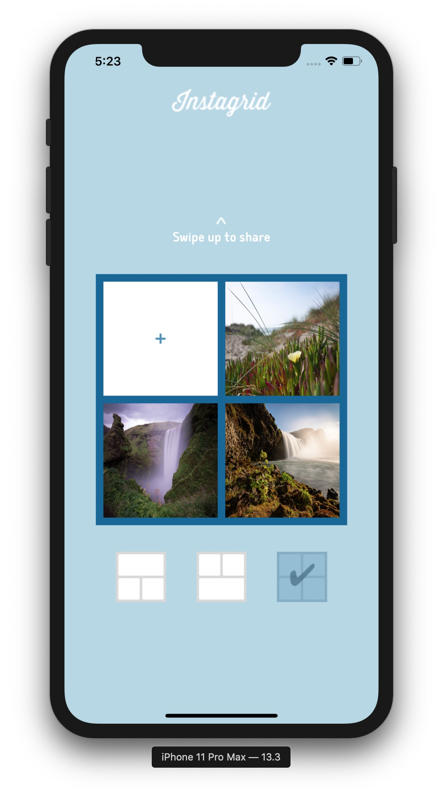

# Instagrid

**Instagrid** allows users to combine photos by choosing from several layouts. The final result is a shareable square.

This project is part of the [OpenClassrooms iOS Developer Path](https://openclassrooms.com/en/paths/74-ios-developer).

## Screenshots

    

## License

The content of this repository is licensed under a [MIT License](LICENSE).
